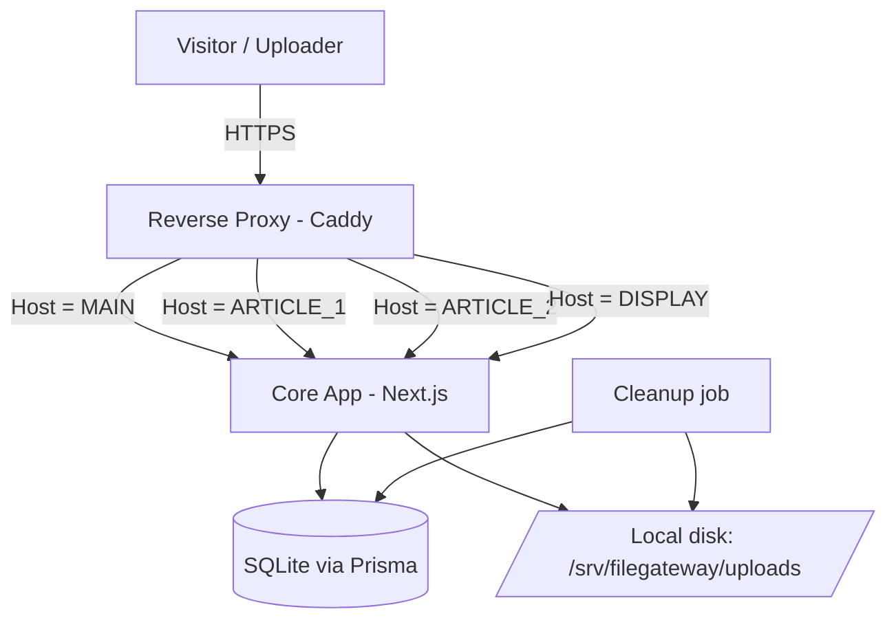
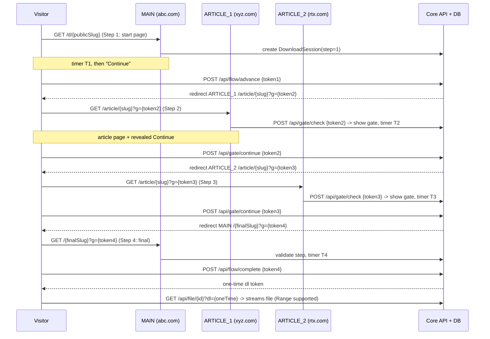

# File Upload & Multi-Hop Download Gateway — Software Design Document (SDD)

> A single-VPS file hosting site with a public upload page, a secret admin dashboard, and a multi-domain "download gateway" flow (start → article 1 → article 2 → final download). Written as a build spec for Claude Code, broken into phases with acceptance criteria.

---

## 0. How to use this document

- Build **phase by phase, in order**. Do not skip ahead — later phases assume earlier ones exist.
- Each phase has: **Goal → Tasks → Deliverables → Acceptance criteria**. Do not mark a phase done until every acceptance box passes.
- Anything marked **[CONFIRM]** is a decision the owner may want to change — use the default if not told otherwise.
- Keep everything in **one monorepo**, one deployable app, one database. Simplicity beats micro-services here.

---

## 1. Product summary

A file-hosting site, mostly for personal use but publicly reachable.

**Public users can:**
- Open the home page and upload **one** file (image, video, or zip), subject to size + per-IP limits.
- Receive a **generated download link** (shown once on the result screen).
- Follow that link through a **timed multi-hop flow** across domains, ending in the actual file download.
- Read system pages: DMCA, Privacy Policy, Terms, Contact.

**The owner (admin) can:**
- Log in via a **secret URL path** (e.g. `main.tld/edusdgusd/login`) with a hardcoded account.
- See a **table of all files** (name, direct link, date, size, type, status, expiry, download count).
- **Quick-download** any file directly (bypassing the gateway).
- **Delete**, **disable ("stop") downloads**, and **set/change expiry** (1d / 7d / 30d / custom / never) per file.
- Configure **per-type size limits**, **per-IP limits**, **storage cap**, **timer durations**, **default expiry**, **domain roles**, and **article pages**.

---

## 2. Assumptions & key decisions

| # | Decision | Default | Notes |
|---|----------|---------|-------|
| A1 | Domains are **roles**, not fixed names | `MAIN`, `ARTICLE_1`, `ARTICLE_2`, optional `DISPLAY` | Owner assigns real domains in settings. |
| A2 | One host-aware app serves all domains | Single Next.js app + reverse proxy | Article sites share code + DB with the core; they only differ by theme + content. **[CONFIRM]** — alternative is separate apps (see §5, Option B). |
| A3 | Storage is **local disk** on the VPS | `/srv/filegateway/uploads` | Hard cap enforced in-app (default 30 GiB). |
| A4 | Database | **SQLite** via Prisma | Perfect for single-VPS personal use. Upgrade path to Postgres documented. **[CONFIRM]** |
| A5 | Admin account is **seeded from env** on first boot | 1 user | "Hardcoded at development" = created from `ADMIN_USERNAME` / `ADMIN_PASSWORD` env on first run, stored hashed. |
| A6 | "Link seen once, gone on refresh" | Result screen shows link once | The link itself stays valid until expiry so it can be shared; only the *result screen* is one-time-view. **[CONFIRM]** — if you want the link itself to be single-use, say so. |
| A7 | Number of article hops | 2 | Configurable to 1 (start → article1 → final) if 2-in-a-row is annoying. |
| A8 | "Show our URL, then redirect to gateway" | Optional `DISPLAY` domain that 302s into the gateway start | If unset, links use the `MAIN` domain directly. |
| A9 | Anti-skip enforcement | Server-side signed step tokens + session | A visitor cannot jump straight to the final download. |
| A10 | Reverse proxy / TLS | **Caddy** (auto HTTPS) | nginx alternative documented. |

**Things worth the owner confirming before build:** A2, A4, A6.

---

## 3. High-level architecture

### 3.1 Domain roles

| Role | Example | Serves |
|------|---------|--------|
| `MAIN` | `abc.com` | Home + upload, system pages, admin dashboard, **gateway start page** (`/d/{slug}`), **final download page**, all APIs. |
| `ARTICLE_1` | `xyz.com` | A normal-looking article blog. Article pages contain a **hidden gate widget** revealed only during a valid flow. |
| `ARTICLE_2` | `rtx.com` | Same as ARTICLE_1, different theme/content. |
| `DISPLAY` (optional) | `links.abc.com` | Pretty link domain that immediately redirects into the `MAIN` gateway start. |

### 3.2 Component diagram



The **same app** answers every domain; middleware inspects the `Host` header and renders the correct "site" (main / article1 / article2 / redirect). This is what makes the article sites centrally manageable from the dashboard while still looking like independent blogs.

### 3.3 The download gateway flow



**Anti-skip:** every step token is a signed JWT carrying `{sessionId, step, nonce}`. The server checks the token against the `DownloadSession` row, verifies the step is the expected next step, **rotates the nonce**, advances the step, and issues the next token. A stolen/replayed token fails because the nonce changed. The final download endpoint refuses unless the session reached the last step and is not yet completed.

---

## 4. Tech stack

| Concern | Choice | Why |
|--------|--------|-----|
| Runtime | Node.js 20 LTS + TypeScript | Broad support, great Claude Code fit. |
| Framework | **Next.js 14+ (App Router)** | One app for public site + admin + API + host-aware article sites. |
| DB | SQLite + **Prisma** | Zero-ops for single VPS; migrations built in. |
| Auth | Cookie sessions via **iron-session**, password hashed with **argon2** | Simple, secure, single hardcoded admin. |
| Tokens | **jose** (signed JWT) | Flow step tokens + one-time download tokens. |
| Uploads | **busboy** / Next route streaming, magic-byte check via **file-type** | Validate real type, not just extension. |
| Validation | **zod** | Every API input validated. |
| Rate limiting | **rate-limiter-flexible** (in-memory or SQLite store) | Upload + flow abuse protection. |
| Reverse proxy / TLS | **Caddy** | Auto Let's Encrypt for all domains. |
| Process mgmt | **systemd** (or pm2) | Keep app alive, restart on boot. |
| Scheduled cleanup | node-cron inside app, or system cron | Expiry + orphan sweep. |
| Styling | **Tailwind CSS** + **CSS variables** for theming; **next-themes** for the light/dark toggle | Modern, minimal, fast to build; token-driven theming. |
| Icons | **lucide-react** | Clean, consistent line icons. |

### 4.1 Design system (applies to every page)

**Direction: modern, minimal, high-end. Lots of whitespace, few elements, strong typography, one accent color. No visual clutter, no stock-template look.**

- **Theming:** ship a real **light / dark toggle** (via `next-themes`) with a **system** default. All colors come from CSS variables (`--bg`, `--fg`, `--muted`, `--card`, `--border`, `--accent`) so both themes and the admin-configurable `accentColor` "just work". Persist the user's choice (cookie/localStorage). No flash of wrong theme on load.
- **Type:** one clean sans (e.g. Inter or Geist) via `next/font`. Generous line-height, clear hierarchy, restrained sizes. Never more than ~2 font weights on a page.
- **Layout:** centered, roomy max-widths; consistent spacing scale (4/8px rhythm); rounded-2xl cards; hairline borders; soft, subtle shadows only where they add meaning.
- **Motion:** small, tasteful transitions (hover, theme switch, the flow timers). Nothing bouncy or loud. Respect `prefers-reduced-motion`.
- **Home + upload:** the upload control is the hero — a single, obvious drop zone + button, minimal supporting text. It should feel effortless.
- **Gateway pages (start / article gate / final):** clean centered card, a clear countdown ring/number, one primary button. Same visual language across all hops so the flow feels cohesive.
- **Admin dashboard:** compact, information-dense but calm — sidebar nav, clean tables, inline actions, subtle empty states. Modern SaaS-console feel, not a bootstrap admin theme.
- **Consistency:** every surface (public, article, admin) shares the same tokens, spacing, and components. Brand text (`siteName`) and accent pull live from settings, so rebranding is instant.
- **Accessibility:** AA contrast in both themes, visible focus rings, keyboard-navigable, semantic HTML.

> Treat this as a hard requirement, not a nice-to-have: a templated/generic UI is a failed acceptance for any page.

---

## 5. Repository structure

**Option A (recommended): single host-aware app.**

```
/filegateway
├── prisma/
│   ├── schema.prisma
│   └── migrations/
├── src/
│   ├── app/
│   │   ├── (main)/                 # rendered only when Host = MAIN
│   │   │   ├── page.tsx             # home + upload
│   │   │   ├── d/[slug]/page.tsx    # gateway START page (step 1)
│   │   │   ├── dl/[finalSlug]/page.tsx  # gateway FINAL page (last step)
│   │   │   ├── dmca/page.tsx
│   │   │   ├── privacy/page.tsx
│   │   │   ├── terms/page.tsx
│   │   │   └── contact/page.tsx
│   │   ├── (article)/              # rendered when Host = ARTICLE_1/2
│   │   │   └── article/[slug]/page.tsx
│   │   ├── [secret]/               # admin, mounted at settings.adminSecretPath
│   │   │   ├── login/page.tsx
│   │   │   └── dashboard/...        # files, settings, articles, domains
│   │   └── api/
│   │       ├── upload/route.ts
│   │       ├── flow/start/route.ts
│   │       ├── flow/advance/route.ts
│   │       ├── flow/complete/route.ts
│   │       ├── gate/check/route.ts
│   │       ├── gate/continue/route.ts
│   │       ├── file/[id]/route.ts        # streams bytes w/ dl token, Range support
│   │       └── admin/...                 # protected admin APIs
│   ├── lib/
│   │   ├── db.ts                  # Prisma client
│   │   ├── settings.ts            # cached settings accessor
│   │   ├── tokens.ts              # sign/verify step + dl tokens
│   │   ├── flow.ts                # flow state machine
│   │   ├── storage.ts            # save/delete files, quota checks
│   │   ├── filetype.ts           # magic-byte + category detection
│   │   ├── ratelimit.ts
│   │   ├── auth.ts               # admin session helpers
│   │   └── ipusage.ts            # per-IP accounting
│   ├── middleware.ts            # host-based site routing + admin path gate
│   └── components/              # shared UI (Timer, GateWidget, FileTable, ...)
├── scripts/
│   ├── seed-admin.ts
│   └── cleanup.ts               # expiry + orphan sweep (also runnable via cron)
├── Caddyfile
├── .env.example
├── package.json
└── README.md
```

**Option B (stronger isolation): separate `core` app + a reusable `article-site` app deployed twice.** Same DB accessed by core; article apps call core's public API over HTTPS. Only choose this if you want the article sites on separate machines or fully sandboxed. Adds CORS + deployment overhead. **Default to Option A.**

---

## 6. Data model (Prisma schema)

```prisma
// prisma/schema.prisma
datasource db { provider = "sqlite"; url = env("DATABASE_URL") }
generator client { provider = "prisma-client-js" }

model Setting {
  id                  Int      @id @default(1)
  // --- Site identity & meta (all editable from the dashboard) ---
  siteName            String   @default("FileGateway")   // brand shown in header, title, footer
  siteTagline         String   @default("")              // short line under the name on the home page
  metaTitle           String   @default("")              // <title> / og:title; falls back to siteName
  metaDescription     String   @default("")              // <meta name=description> / og:description
  ogImageUrl          String   @default("")              // social share image (absolute URL)
  faviconUrl          String   @default("")              // optional custom favicon
  themeDefault        String   @default("system")        // light | dark | system
  accentColor         String   @default("#6366f1")       // primary accent used across the UI
  // --- Storage & limits ---
  storageCapBytes     BigInt   @default(32212254720) // 30 GiB
  imageMaxBytes       BigInt   @default(10485760)     // 10 MiB
  videoMaxBytes       BigInt   @default(524288000)    // 500 MiB
  zipMaxBytes         BigInt   @default(524288000)    // 500 MiB
  ipDailyMaxUploads   Int      @default(20)
  ipDailyMaxBytes     BigInt   @default(1073741824)   // 1 GiB / day / IP
  timerStartSeconds   Int      @default(5)
  timerArticleSeconds Int      @default(8)
  timerFinalSeconds   Int      @default(5)
  defaultExpiry       String   @default("7d")         // 1d | 7d | 30d | never
  articleHops         Int      @default(2)            // 1 or 2
  mainDomain          String   @default("")
  article1Domain      String   @default("")
  article2Domain      String   @default("")
  displayDomain       String?                          // optional pretty-link domain
  adminSecretPath     String   @default("admin")       // set at deploy
  updatedAt           DateTime @updatedAt
}

model FileItem {
  id              String    @id @default(cuid())
  publicSlug      String    @unique      // used in /d/{publicSlug}
  finalSlug       String    @unique      // used in final download page
  originalName    String
  storedName      String    @unique      // random on-disk filename
  mimeType        String
  category        String                 // "image" | "video" | "zip"
  sizeBytes       BigInt
  sha256          String?
  uploaderIp      String
  status          String    @default("active")  // active | disabled | deleted
  downloadEnabled Boolean   @default(true)
  downloadCount   Int       @default(0)
  createdAt       DateTime  @default(now())
  expiresAt       DateTime?
  @@index([status, expiresAt])
  @@index([uploaderIp, createdAt])
}

model DownloadSession {
  id          String   @id @default(cuid())
  fileId      String
  currentStep Int      @default(1)   // 1..(2 + articleHops)
  nonce       String                  // rotated every advance (replay defense)
  visitorIp   String?
  completed   Boolean  @default(false)
  createdAt   DateTime @default(now())
  expiresAt   DateTime                // short TTL, e.g. now + 20 min
  @@index([expiresAt])
}

model ArticlePage {
  id        String   @id @default(cuid())
  siteKey   String                    // "article1" | "article2"
  slug      String
  title     String
  body      String                    // markdown or sanitized HTML
  active    Boolean  @default(true)
  createdAt DateTime @default(now())
  updatedAt DateTime @updatedAt
  @@unique([siteKey, slug])
}

model AdminUser {
  id           Int      @id @default(autoincrement())
  username     String   @unique
  passwordHash String
  createdAt    DateTime @default(now())
}

model AuditLog {           // optional but recommended
  id        String   @id @default(cuid())
  action    String            // upload | download | admin_login | delete | ...
  detail    String?
  ip        String?
  createdAt DateTime @default(now())
}
```

> **Total step count** = `2 + articleHops`. With `articleHops = 2`: step 1 = start, 2 = article1, 3 = article2, 4 = final. With `articleHops = 1`: step 1 = start, 2 = article1, 3 = final.

---

## 7. Flow token design (critical, get this right)

Two token types, both signed with `TOKEN_SECRET` (HS256 via `jose`):

**Step token** — payload `{ sid, step, nonce, exp }`, TTL ~10 min.
- Issued when a session is created (step 1) and after every successful advance.
- To advance: verify signature → load `DownloadSession(sid)` → check `step === session.currentStep` **and** `nonce === session.nonce` **and** not `completed` and not expired → generate new nonce, set `currentStep += 1`, save → mint next step token for the next hop URL.

**One-time download token** — payload `{ sid, fileId, exp }`, TTL ~60 s, single use.
- Minted by `POST /api/flow/complete` only when the session is at the final step.
- `GET /api/file/{id}?dl=...` verifies it, marks session `completed`, increments `downloadCount`, streams bytes, and the token cannot be reused (session already completed).

**Redirect URL construction** (server decides the next hop):
- Step 1 → next = `https://{ARTICLE_1}/article/{randomActiveArticleSlug}?g={token2}`
- Step 2 → next = `https://{ARTICLE_2}/article/{randomActiveArticleSlug}?g={token3}` (or final if `articleHops === 1`)
- Step 3 → next = `https://{MAIN}/dl/{finalSlug}?g={token4}`

Article slugs are chosen at random from **active** `ArticlePage` rows for that `siteKey`, so the same download link rotates through different articles.

---

## 8. API reference

### Public
- `POST /api/upload` — multipart body `file`. Validates category, size (per-type), per-IP limits, storage cap; stores file; returns `{ displayLink, expiresAt }`. **Result link shown once client-side.**
- `POST /api/flow/start` — `{ publicSlug }` — creates session, returns `{ nextUrl }` (article1 URL with token). Called by the "Continue" button on the start page. (Alternatively the start page creates the session on load and hands the button a token.)
- `POST /api/flow/advance` — `{ token }` — `{ nextUrl }`. Generic advance used between hops.
- `POST /api/flow/complete` — `{ token }` (final step) — `{ downloadUrl }` (contains one-time dl token).
- `GET /api/file/{id}?dl={token}` — streams the file with `Content-Disposition: attachment` and **HTTP Range support** (resumable video/zip downloads).

### Article-site facing (same origin in Option A; CORS-guarded in Option B)
- `POST /api/gate/check` — `{ token }` — `{ show: boolean, timerSeconds }`. Called by the gate widget on article page load. If `show=false`, the widget stays hidden and the page looks like a normal blog post.
- `POST /api/gate/continue` — `{ token }` — `{ nextUrl }`. Advances the flow from an article page.
- `GET /api/articles/{siteKey}/{slug}` — returns `{ title, body }` for rendering (Option B only; Option A reads DB directly).

### Admin (all under `/{adminSecretPath}`, session required)
- `POST /{secret}/api/login` — `{ username, password }` — sets session cookie. Rate-limited, generic error on failure.
- `POST /{secret}/api/logout`
- `GET  /{secret}/api/files?query=&page=&category=&status=` — paginated list.
- `GET  /{secret}/api/files/{id}/download` — **admin direct download**, bypasses the gateway entirely.
- `PATCH /{secret}/api/files/{id}` — `{ expiresAt?, downloadEnabled? }` (set expiry / stop-resume download).
- `POST /{secret}/api/files/{id}/disable` and `/enable`
- `DELETE /{secret}/api/files/{id}` — delete DB row + disk file.
- `GET/PUT /{secret}/api/settings` — read/update all `Setting` fields (validated).
- `GET/POST/PATCH/DELETE /{secret}/api/articles` — article CRUD.
- `GET /{secret}/api/stats` — storage used/free, file counts, per-day upload counts.

All admin write endpoints require a valid session **and** an anti-CSRF check.

---

## 9. Environment variables (`.env.example`)

```
DATABASE_URL="file:./prod.db"
NODE_ENV="production"

# Secrets (generate with: openssl rand -base64 48)
SESSION_SECRET="..."     # iron-session cookie
TOKEN_SECRET="..."       # signs flow + download tokens

# Admin bootstrap (seeded once on first run, then remove/rotate)
ADMIN_USERNAME="owner"
ADMIN_PASSWORD="change-me-strong"

# Storage
UPLOAD_DIR="/srv/filegateway/uploads"

# Domains (can also be edited later in the dashboard; these seed the Setting row)
MAIN_DOMAIN="abc.com"
ARTICLE1_DOMAIN="xyz.com"
ARTICLE2_DOMAIN="rtx.com"
DISPLAY_DOMAIN=""        # optional
ADMIN_SECRET_PATH="edusdgusd"
```

---

## 10. Storage & quota strategy

- All files live under `UPLOAD_DIR`, stored under a **random `storedName`** (never the user's filename) to prevent path traversal and collisions. Original name kept only in DB.
- **Before accepting an upload:** `SUM(sizeBytes of active files) + incomingSize <= storageCapBytes`. Reject with 507 if over.
- Enforce **per-type max size** and **per-IP daily count/bytes** (compute per-IP usage from `FileItem` where `uploaderIp = X AND createdAt >= startOfDay`, or maintain a counter — computing from the table is simplest and fine at this scale).
- Serve downloads with **Range support** so large videos/zips resume.
- Keep the app's usage under the 30 GiB app budget even though the VPS has 50 GiB, leaving headroom for OS, DB, logs. Expose "storage used / cap" on the dashboard.

---

## 11. Security checklist (apply throughout, verify in Phase 9)

- [ ] File type verified by **magic bytes** (`file-type`), not extension; category derived from real type; reject anything not image/video/zip.
- [ ] Stored filenames are random; original name never used on disk; download sets `Content-Disposition: attachment` and a safe `Content-Type` (never `text/html`).
- [ ] Uploads streamed with a hard byte ceiling; connection aborted if exceeded.
- [ ] Admin password hashed with argon2; login rate-limited; generic failure message; session cookie `httpOnly`, `secure`, `sameSite=lax`; CSRF token on admin mutations.
- [ ] Admin path is configurable and not linked anywhere public.
- [ ] Flow tokens signed, short TTL, nonce-rotated, step-checked; final download requires last step + one-time token.
- [ ] Rate limits on `/api/upload`, `/api/flow/*`, `/api/gate/*`, and admin login.
- [ ] CORS locked to article domains (Option B); same-origin in Option A.
- [ ] Security headers: `X-Content-Type-Options: nosniff`, `Referrer-Policy`, CSP, HSTS (via Caddy).
- [ ] Article `body` sanitized before render (if HTML) or rendered from Markdown with a safe renderer.
- [ ] No stack traces leaked to clients; structured server logs + `AuditLog`.

---

## 12. Build plan — phases

### Phase 0 — Project scaffold & infra
**Goal:** Runnable empty app + tooling + config.
**Tasks:** Init Next.js + TS; add Prisma, zod, jose, argon2, iron-session, file-type, busboy, rate-limiter-flexible, **Tailwind, next-themes, lucide-react**; set up the **design tokens (CSS variables) + light/dark ThemeProvider** and a shared root layout per §4.1 (no theme flash); load the app font via `next/font`; add ESLint/Prettier; create `.env.example`; write `Caddyfile` skeleton; create `UPLOAD_DIR`; commit repo structure from §5.
**Deliverables:** App boots on `MAIN` locally; health route `GET /api/health` returns ok; working theme toggle on the placeholder page.
**Acceptance:** `npm run dev` serves a placeholder home page **that respects the design system and toggles light/dark with no flash**; lint passes; `.env.example` complete.

### Phase 1 — Data model, settings, admin seed
**Goal:** DB + settings service + seeded admin.
**Tasks:** Implement §6 schema; run initial migration; `lib/settings.ts` (read-through cache, single `Setting` row auto-created from env on first boot); `scripts/seed-admin.ts` creating the admin from `ADMIN_USERNAME/PASSWORD` (argon2) if none exists; `lib/db.ts`.
**Deliverables:** Migrations, seed script, settings accessor.
**Acceptance:** Fresh DB → one `Setting` row + one `AdminUser`; changing a setting persists; re-running seed is idempotent.

### Phase 2 — Public site + upload
**Goal:** Home page upload works end to end (minus the gateway).
**Tasks:** Home page with single upload control (drag/drop + button), styled per §4.1; **pull `siteName` / `siteTagline` into the header, footer, and hero, and drive `<title>` + `<meta>` + Open Graph/Twitter tags from `metaTitle` / `metaDescription` / `ogImageUrl` / `faviconUrl` (falling back to `siteName`) via Next `generateMetadata`, reading live from settings**; `POST /api/upload` with magic-byte detection, per-type size check, per-IP check, storage-cap check, random `storedName`, generate `publicSlug` + `finalSlug`, set `expiresAt` from `defaultExpiry`; return `{ displayLink }` where `displayLink` uses `DISPLAY` domain if set else `MAIN/d/{publicSlug}`; **result screen shows link once** (client state only, lost on refresh); build system pages (DMCA, Privacy, Terms, Contact) with editable static content.
**Deliverables:** Working upload → link; files on disk; DB rows; system pages; brand + meta rendered from settings.
**Acceptance:** Upload an image/video/zip → file saved, row created, link shown; oversized/wrong-type/over-quota/over-IP-limit uploads rejected with clear messages; refreshing the result screen loses the link; **changing `siteName`/meta in the DB is reflected in the header, page title, and social preview tags without a code change.**

### Phase 3 — Download gateway flow (start + final)
**Goal:** The hop machinery, minus article theming.
**Tasks:** `lib/flow.ts` state machine + `lib/tokens.ts`; `MAIN /d/[slug]` start page (timer `timerStartSeconds`, Continue button → creates session, redirects to next hop); `/api/flow/advance`, `/api/flow/complete`; `MAIN /dl/[finalSlug]` final page (validate last-step token, timer `timerFinalSeconds`, Download button); `GET /api/file/[id]?dl=` streaming with Range; increment `downloadCount`; enforce expiry, `downloadEnabled`, and `status`.
**Deliverables:** Full flow works even if the "article" hops are temporarily plain pages on MAIN.
**Acceptance:** Happy path completes and downloads the correct bytes; skipping directly to `/dl/...` or `/api/file/...` without a valid last-step token is refused; expired/disabled files refuse download; replaying an old step token fails (nonce rotated); one-time dl token can't be reused.

### Phase 4 — Article sites + gate widget
**Goal:** Real article blogs on `ARTICLE_1`/`ARTICLE_2` with hidden gates.
**Tasks:** `middleware.ts` host routing (MAIN vs ARTICLE_1 vs ARTICLE_2 vs DISPLAY redirect); `(article)/article/[slug]` renders an `ArticlePage` as a normal blog post; `GateWidget` component that on load calls `POST /api/gate/check` with `?g=` token → **hidden by default**, revealed with timer (`timerArticleSeconds`) + Continue only when `show=true`; Continue calls `POST /api/gate/continue` → redirect to next hop; wire the flow's article steps to pick a random active article per `siteKey`.
**Deliverables:** Two themable article sites; gate invisible when visited directly, visible only mid-flow.
**Acceptance:** Visiting an article URL **without** a valid token shows a plain post (no timer/button); visiting **with** a valid token reveals the gate after the timer; completing both article hops routes correctly to the final page; `articleHops = 1` skips the second article cleanly.

### Phase 5 — Admin auth & dashboard shell
**Goal:** Secret login + protected dashboard skeleton.
**Tasks:** Mount admin under `settings.adminSecretPath`; `/{secret}/login` page; `POST /{secret}/api/login` (argon2 verify, iron-session cookie, rate-limited, CSRF); auth guard for all `/{secret}/*`; dashboard layout with nav (Files, Settings, Articles, Domains, Stats); logout.
**Deliverables:** Working login + empty dashboard sections.
**Acceptance:** Correct creds → dashboard; wrong creds → generic error + rate limit; unauthenticated access to any admin route → redirect to login; visiting a wrong secret path → 404.

### Phase 6 — Admin: files management
**Goal:** The files table + all per-file actions.
**Tasks:** `GET /{secret}/api/files` (search, filter by category/status, pagination, sort by date); files table UI showing name, direct link, date, size, type, status, download count, expiry; actions: **copy link**, **quick-download** (`/{secret}/api/files/{id}/download`, bypasses gateway), **delete** (DB + disk), **disable/enable download** ("stop download"), **set/change expiry** (1d/7d/30d/custom/never).
**Deliverables:** Fully operable files table.
**Acceptance:** Every action reflects immediately in the table and on the public side (disabled file refuses public download; deleted file 404s and disk file removed; changed expiry enforced); admin quick-download returns bytes without touching the gateway.

### Phase 7 — Admin: settings, domains, articles
**Goal:** Everything configurable from the dashboard.
**Tasks:** **Site Identity & Appearance form (`siteName`, `siteTagline`, `metaTitle`, `metaDescription`, `ogImageUrl`, `faviconUrl`, `themeDefault` light/dark/system, `accentColor`) — with a live preview of how the header + share card will look;** Settings form (per-type size limits, per-IP limits, storage cap, three timer durations, default expiry, `articleHops` 1/2); Domains form (MAIN/ARTICLE_1/ARTICLE_2/DISPLAY, admin secret path — with a clear warning that changing the secret path changes the login URL); Articles CRUD (create/edit/delete, per `siteKey`, active toggle, live count of active articles per site). Validate all inputs with zod; invalidate settings cache on save.
**Deliverables:** Owner can rebrand and reconfigure the whole system without code changes.
**Acceptance:** Editing site name/tagline/meta/accent/default-theme updates every public and article page (title, header, footer, social tags, accent) on next load; new limits take effect on the next upload; new timers take effect on the next flow; changing domains updates generated links and host routing; adding/deactivating articles changes which posts the flow uses; changing `articleHops` changes hop count live.

### Phase 8 — Expiry, cleanup & quota jobs
**Goal:** Automatic housekeeping.
**Tasks:** `scripts/cleanup.ts` — delete files past `expiresAt` (DB + disk), purge expired `DownloadSession` rows, remove orphaned disk files with no DB row; schedule via node-cron (e.g. every 15 min) and document a system-cron fallback; recompute + expose storage usage.
**Deliverables:** Self-cleaning storage.
**Acceptance:** An expired file is gone from disk and public access within one cleanup cycle; storage-used figure matches actual disk usage; orphan files are reclaimed.

### Phase 9 — Security hardening & rate limiting
**Goal:** Lock it down (verify the §11 checklist).
**Tasks:** Add rate limits to upload/flow/gate/login; security headers + CSP; sanitize article HTML/Markdown; confirm magic-byte enforcement and safe download content types; ensure no stack traces leak; populate `AuditLog` for upload/download/login/delete; add basic bot friction on upload (e.g. simple challenge) **[CONFIRM]**.
**Deliverables:** Hardened app.
**Acceptance:** Every §11 box checked; abusive request patterns get throttled; malformed/oversized uploads and forged tokens are rejected cleanly.

### Phase 10 — Deployment & ops
**Goal:** Live on the VPS across all domains.
**Tasks:** Full `Caddyfile` for MAIN + ARTICLE_1 + ARTICLE_2 (+ DISPLAY redirect) with auto-TLS; systemd unit (or pm2) for the app; production build; run migrations + seed; set up cron for cleanup; DB + uploads backup script; README runbook (start/stop/logs/restore, rotating secrets, changing admin password).
**Deliverables:** Publicly reachable, HTTPS, all domains routing correctly.
**Acceptance:** All four domain roles resolve over HTTPS to the right behavior; upload→flow→download works end to end in production; reboot brings everything back; backups produce a restorable snapshot.

---

## 13. Deployment notes

**DNS:** point `MAIN`, `ARTICLE_1`, `ARTICLE_2` (and `DISPLAY` if used) A/AAAA records at the VPS IP.

**Caddyfile sketch** (fill domains from settings/env):
```
abc.com {                      # MAIN
  reverse_proxy 127.0.0.1:3000
  header Strict-Transport-Security "max-age=31536000"
}
xyz.com, rtx.com {             # ARTICLE_1 / ARTICLE_2 (same app, host-aware)
  reverse_proxy 127.0.0.1:3000
}
# links.abc.com { redir https://abc.com{uri} 302 }   # DISPLAY handled in-app instead if you need slug rewriting
```
> For the `DISPLAY` domain, handle the redirect **in the app** (so `display/{slug}` → `MAIN/d/{slug}`), not a blanket Caddy redirect, so slugs map correctly.

**Large downloads:** Next streaming with Range works; if you later see memory pressure on big videos, move byte-serving to Caddy via an internal authenticated location and have the app return an `X-Accel`/internal-redirect style handoff. Not needed at MVP.

---

## 14. Testing strategy

- **Unit:** token sign/verify + nonce rotation; storage-cap and per-IP math; file-type detection; expiry calculation.
- **Integration:** upload → link → full hop flow → download of exact bytes; skip-attempt rejections; disabled/expired refusals; admin actions reflected publicly.
- **Manual matrix:** each domain role in a fresh browser; direct article visit (no gate) vs in-flow (gate shows); `articleHops` = 1 and 2; DISPLAY on/off.

---

## 15. Non-goals (MVP)

- No public user accounts (only the single admin).
- No multi-file/folder uploads (one file per upload; revisit later).
- No S3/object storage (local disk only).
- No payment/ads integration logic beyond the hop pages themselves.
- No horizontal scaling / clustering.

## 16. Future enhancements

- Optional 2FA on admin login.
- S3-compatible storage backend behind the same `storage.ts` interface.
- Per-article "reveal after scroll" behavior for the gate.
- Download analytics per file / per country.
- Bulk actions in the files table; CSV export.

---

## 17. Glossary

- **Gateway flow** — the timed multi-domain journey from link to file.
- **Step token** — signed, short-lived, nonce-rotated token proving which flow step the visitor is on.
- **Gate widget** — hidden timer+Continue block on article pages, revealed only during a valid flow.
- **siteKey** — `article1` / `article2`; ties an `ArticlePage` to a domain role.
- **DISPLAY domain** — optional pretty-link domain that redirects into the gateway start.
